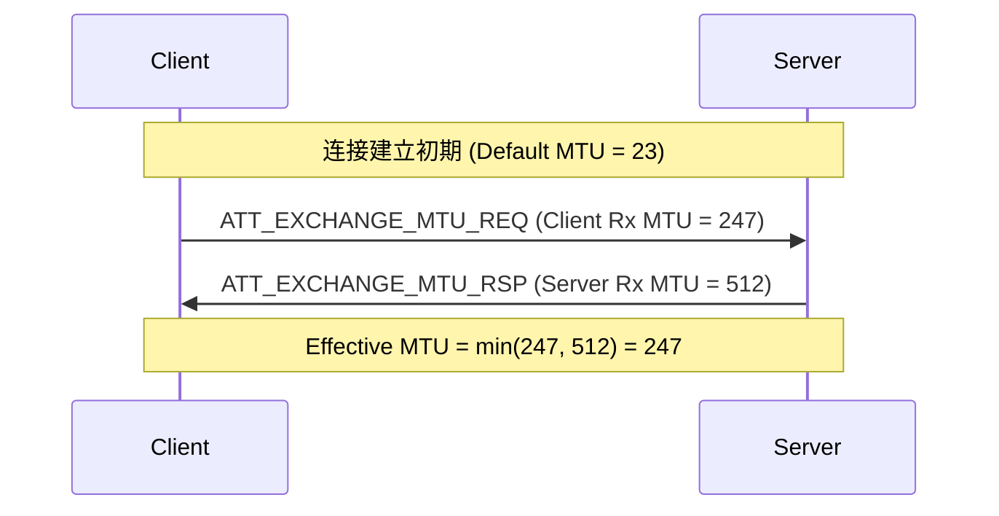

# Attribute Protocol (ATT) 深度解析

**ATT (Attribute Protocol)** 是蓝牙低功耗 (BLE) 数据传输的基石。GATT (Generic Attribute Profile) 定义了数据的逻辑结构（服务/特征），而 ATT 则定义了这些数据如何在空口进行具体的字节级传输。

> **核心参考**: *Bluetooth Core Spec v6.2, Vol 3, Part F*

---

## 1. 协议基础 (Protocol Basics)

ATT 是一个基于 **Client/Server** 架构的协议：
*   **Server**: 存储数据（Attributes）的一方（如手环）。
*   **Client**: 请求读写数据的一方（如手机）。

### 1.1 Attribute 三要素
每个 Attribute 由三个核心部分组成：

1.  **Attribute Handle (16-bit)**: 数据的唯一地址（类似内存地址，如 `0x0012`）。
2.  **Attribute Type (UUID)**: 数据的类型（如 `0x2A37` 代表心率测量值）。
3.  **Attribute Value**: 实际的数据内容。

---

## 2. PDU 格式 (Packet Structure)

ATT PDU 嵌入在 L2CAP 的 B-Frame 中（CID = 0x0004）。

| Field                    | Size     | Description              |
| :----------------------- | :------- | :----------------------- |
| **Attribute Opcode**     | 1 Bytes  | 操作码，指示 PDU 类型（读请求、写命令等）。 |
| **Attribute Parameters** | Variable | 参数或数据载荷。                 |

### 2.1 Opcode 位域解析

Opcode 的 8 个 bit 包含了丰富的元信息：

`Bit 7` | `Bit 6` | `Bit 5` | `Bit 4` | `Bit 3` | `Bit 2` | `Bit 1` | `Bit 0`
--- | --- | --- | --- | --- | --- | --- | ---
**Auth Signature** | **Command** | **Method** (Bit 5-0) | ... | ... | ... | ... | ...

*   **Command Flag (Bit 6)**:
    *   `0`: Request/Response/Indication/Notification (需要响应或作为响应)。
    *   `1`: Command (无需响应，如 `Write Command`)。
*   **Authentication Signature Flag (Bit 7)**:
    *   `1`: 数据包包含 `Authentication Signature`（用于 Signed Write）。

---

## 3. 核心 Opcode 参考 (Opcode Reference)

以下是抓包分析时最常用的 Opcode 字典：

### 3.1 错误处理
*   `0x01` - **ATT_ERROR_RSP**: 请求失败时返回。包含导致错误的 Handle 和错误码。

### 3.2 MTU 交换
*   `0x02` - **ATT_EXCHANGE_MTU_REQ**: Client 请求更改 MTU。
*   `0x03` - **ATT_EXCHANGE_MTU_RSP**: Server 响应支持的 MTU。

### 3.3 信息发现 (Discovery)
*   `0x04` - **ATT_FIND_INFORMATION_REQ**: 获取 Handle 和 UUID 映射。
*   `0x05` - **ATT_FIND_INFORMATION_RSP`
*   `0x08` - **ATT_READ_BY_TYPE_REQ**: 按 UUID 读取（常用于发现 Characteristic）。
*   `0x09` - **ATT_READ_BY_TYPE_RSP`

### 3.4 读取 (Reading)
*   `0x0A` - **ATT_READ_REQ**: 读取指定 Handle 的值。
*   `0x0B` - **ATT_READ_RSP`
*   `0x0C` - **ATT_READ_BLOB_REQ**: 读取长数据的片段 (Offset Read)。
*   `0x0D` - **ATT_READ_BLOB_RSP`

### 3.5 写入 (Writing)
*   `0x12` - **ATT_WRITE_REQ**: 写请求（Server 必须回 RSP）。
*   `0x13` - **ATT_WRITE_RSP**: 写响应。
*   `0x52` - **ATT_WRITE_CMD**: 写命令（无响应，这也是为何 Bit 6 置位的原因: `0x12 | 0x40 = 0x52`）。
*   `0x16` - **ATT_PREPARE_WRITE_REQ**: 准备写（用于长数据）。
*   `0x18` - **ATT_EXECUTE_WRITE_REQ**: 执行写。

### 3.6 服务器推送
*   `0x1B` - **ATT_HANDLE_VALUE_NTF**: Notification (Client 不回)。
*   `0x1D` - **ATT_HANDLE_VALUE_IND**: Indication (Client 回 CFM)。
*   `0x1E` - **ATT_HANDLE_VALUE_CFM**: Confirmation。

---

## 4. MTU 交换流程 (MTU Exchange)

BLE 默认的 ATT MTU 是 **23 字节** (3 bytes Header + 20 bytes Data)。为了提高吞吐量，双方必须协商更大的 MTU。

*   **规则**: 最终使用的 MTU 是 `min(Client_Rx_MTU, Server_Rx_MTU)`。
*   **时机**: 通常在连接建立且加密完成后立即进行。
*   **注意**: 只有 Client 能发起 Request。

---

## 5. 常见错误码 (Error Codes)

当 Server 返回 `ATT_ERROR_RSP (0x01)` 时，第三个字节是 Error Code：

| Code | Name | Meaning |
| :--- | :--- | :--- |
| `0x01` | **Invalid Handle** | 请求的 Handle 不存在。 |
| `0x03` | **Write Not Permitted** | 该属性不支持写操作。 |
| `0x05` | **Insufficient Authentication** | 链路未加密或未配对。 |
| `0x0A` | **Attribute Not Found** | 指定范围内没找到属性。 |
| `0x0D` | **Invalid Attribute Value Length** | 写入的数据长度不对。 |

---

## 6. 开发者贴士

1.  **Write Command vs Request**: 需要高吞吐且允许丢包（如计步器实时数据）用 `Write Command`；需要可靠性（如配置参数）用 `Write Request`。
2.  **MTU 陷阱**: 即使协商了 MTU = 247，L2CAP 可能会对数据进行分片传输，应用层看到的是完整的 244 字节数据，但底层可能拆成了多个空口包。
3.  **Indication 阻塞**: Indication 是“停等协议”，在收到 CFM 之前不能发送下一个 Indication。不要用它传高频数据。
