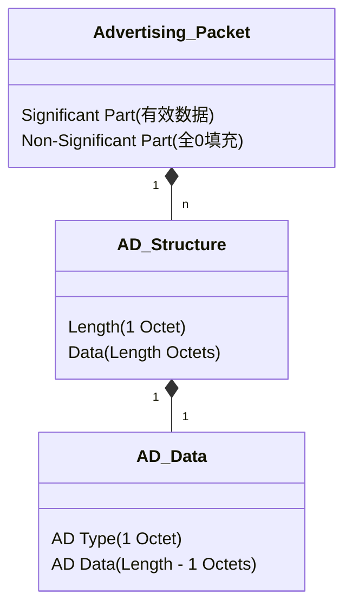

# GAP Advertising Data Format (广播数据格式)

广播数据 (Advertising Data) 和扫描响应数据 (Scan Response Data) 是蓝牙低功耗 (BLE) 设备向外宣告自身存在、能力和服务的主要方式。GAP 定义了这些数据的通用格式，即 **LTV (Length-Type-Value)** 结构。

> **核心参考**: *Bluetooth Core Spec v6.2, Vol 3, Part C, Section 11*

---

## 1. 数据包结构 (Packet Structure)

广播数据包的最大载荷长度取决于具体的 PDU 类型（如 Legacy Advertising 为 31 字节，Extended Advertising 可达 254 字节甚至更多）。但无论载荷大小，内部数据结构始终由一系列 **AD Structure** 组成。

### 1.1 结构图解

### 1.2 字节级布局

每个 **AD Structure** 包含三个部分：

| Offset | Field | Size | Description |
| :--- | :--- | :--- | :--- |
| 0 | **Length** | 1 Byte | 后续 Data 字段的长度（**不包含** Length 字节本身）。  *例如：Length = 3，表示后面有 3 个字节的数据。* |
| 1 | **AD Type** | 1 Byte | 数据类型标识符 (如 `0x01` 代表 Flags, `0x09` 代表完整名称)。 |
| 2 ... N | **AD Data** | (Length-1) Bytes | 实际的数据负载。 |

> **注意**: 如果数据未填满最大载荷，剩余部分通常填充为 `0x00`，这部分称为 **Non-significant part**，接收端解析时应忽略。

---

## 2. 常用 AD Types 解析

具体的 AD Type 定义由 *Core Specification Supplement (CSS)* 维护，ID 分配参考 *Assigned Numbers*。以下列出开发中最常见的类型。

### 2.1 Flags (`0x01`)

**Flags** 通常是广播包中的第一个 AD Structure，用于指示设备的发现模式和能力。

*   **Type**: `0x01`
*   **Data**: Bitmap (通常 1 字节)

| Bit | Name | Description |
| :--- | :--- | :--- |
| **0** | **LE Limited Discoverable Mode** | 设备处于“有限可发现模式”（通常广播约 30秒后停止）。 |
| **1** | **LE General Discoverable Mode** | 设备处于“通用可发现模式”（长期广播，最常用）。 |
| **2** | **BR/EDR Not Supported** | **重要**: 对于纯 BLE 设备 (如手环、传感器)，此位必须置 **1**。 |
| 3 | Controller: Simultaneous LE and BR/EDR | 同时支持 BLE 和经典蓝牙 (Controller 层)。 |
| 4 | Host: Simultaneous LE and BR/EDR | 同时支持 BLE 和经典蓝牙 (Host 层)。 |

> **典型值**: `02 01 06`
> *   `02`: Length = 2 bytes (Type + Value)
> *   `01`: Type = Flags
> *   `06`: Value = `0000 0110` (Bit 1 + Bit 2) -> General Discoverable + BR/EDR Not Supported.

### 2.2 Local Name (`0x08`, `0x09`)

设备名称，用于手机扫描列表中显示。

*   **Complete Local Name (`0x09`)**: 完整的设备名称。
*   **Shortened Local Name (`0x08`)**: 缩略名称（当完整名称太长放不下时使用）。

> **示例**: `05 09 4E 6F 64 65`
> *   `05`: Length
> *   `09`: Type (Complete Name)
> *   `4E 6F 64 65`: ASCII "Node"

### 2.3 Service UUIDs (`0x02` - `0x07`)

列出设备支持的服务 UUID，方便 App 过滤和识别设备功能。

| Type | Description |
| :--- | :--- |
| `0x02` | Incomplete List of 16-bit Service UUIDs |
| `0x03` | Complete List of 16-bit Service UUIDs |
| `0x04` | Incomplete List of 32-bit Service UUIDs |
| `0x05` | Complete List of 32-bit Service UUIDs |
| `0x06` | Incomplete List of 128-bit Service UUIDs |
| `0x07` | Complete List of 128-bit Service UUIDs |

> **示例**: `03 03 0D 18`
> *   `03`: Length
> *   `03`: Type (Complete 16-bit UUIDs)
> *   `0D 18`: Value (`0x180D` Heart Rate Service，**小端序**)

### 2.4 Manufacturer Specific Data (`0xFF`)

厂商自定义数据，常用于 iBeacon、私有协议广播等。

*   **Type**: `0xFF`
*   **Data**: 
    *   前 2 字节: **Company Identifier Code** (由 SIG 分配，小端序)。
    *   剩余字节: 厂商自定义数据。

> **示例 (Apple iBeacon Header)**: `06 FF 4C 00 02 15`
> *   `4C 00`: Apple Inc. (`0x004C`)
> *   `02 15`: iBeacon Prefix (自定义内容)

---

## 3. 解析实例 (Example)

假设抓包得到以下 Hex 数据：
`02 01 06 05 09 42 6C 75 65 00 00 ...`

**解析过程**:

1.  **Read Byte 0**: `0x02` (Length)
    *   读取接下来的 2 字节作为 Structure 1。
    *   **Structure 1**: `01 06`
        *   Type: `0x01` (Flags)
        *   Value: `0x06` (General Disc, BR/EDR Not Supported)
2.  **Read Byte 3**: `0x05` (Length)
    *   读取接下来的 5 字节作为 Structure 2。
    *   **Structure 2**: `09 42 6C 75 65`
        *   Type: `0x09` (Complete Local Name)
        *   Value: "Blue" (`42 6C 75 65`)
3.  **Read Byte 9**: `0x00` (Length)
    *   长度为 0，解析结束。后续全为 Padding。

---

## 4. 总结

*   **LTV 格式**: 必须严格遵守 Length-Type-Value 格式。
*   **小端序**: 多字节字段（如 UUID, Company ID）通常使用 Little Endian。
*   **优先级**: Flags 通常放在最前面，便于扫描设备快速判断。
