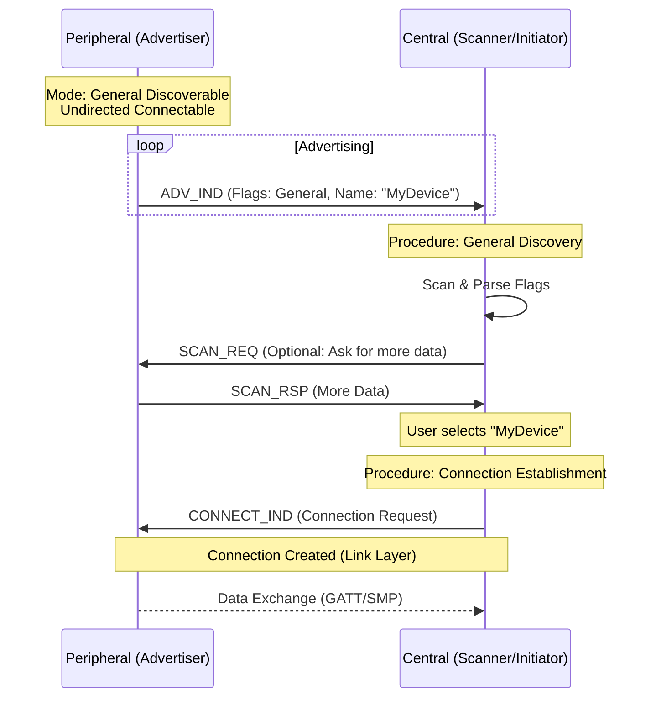

# GAP Modes & Procedures (模式与过程)

GAP 定义了设备在不同状态下的行为模式 (Modes) 以及如何与其他设备交互的过程 (Procedures)。理解这些模式是开发蓝牙应用的第一步，决定了设备是作为“被发现者”还是“发现者”，是“等待连接”还是“发起连接”。

> **核心参考**: *Bluetooth Core Spec v6.2, Vol 3, Part C, Section 9*

---

## 1. GAP 角色回顾 (Roles)

在深入模式之前，回顾一下 BLE 的四种基本角色：

| Role | Description | Typical Device |
| :--- | :--- | :--- |
| **Broadcaster** | 仅发送广播，不可连接。 | 温度传感器 (Beacon) |
| **Observer** | 仅扫描广播，不发起连接。 | 只有显示屏的温度计 |
| **Peripheral** | 发送广播，**可被连接**，在连接中作为从设备。 | 智能手环、心率带 |
| **Central** | 扫描广播，**发起连接**，在连接中作为主设备。 | 手机、平板 |

---

## 2. 发现模式 (Discovery Modes)

这组模式决定了设备“是否可见”以及“可见多久”。

### 2.1 Non-Discoverable Mode (不可发现模式)
*   **定义**: 设备不希望被发现。
*   **行为**: 可以发送广播，但广播包中的 Flags 字段不设置 `Limited` 或 `General` 标志。
*   **场景**: 设备已经与手机连接，不想被其他人搜索到。

### 2.2 Limited Discoverable Mode (有限可发现模式)
*   **定义**: 设备仅在一段有限的时间内（通常 < 30秒）可见。
*   **行为**: 
    *   广播 Flags 设置 `LE Limited Discoverable Mode` (Bit 0)。
    *   通常配合快速广播间隔。
*   **场景**: 用户按下配对按钮后，设备进入此模式等待连接。

### 2.3 General Discoverable Mode (通用可发现模式)
*   **定义**: 设备在很长一段时间内（或永久）可见。
*   **行为**: 
    *   广播 Flags 设置 `LE General Discoverable Mode` (Bit 1)。
*   **场景**: 智能灯泡、一直等待连接的手环。

---

## 3. 连接模式 (Connection Modes)

这组模式决定了设备“是否接受连接”以及“接受谁的连接”。

### 3.1 Non-Connectable Mode (不可连接模式)
*   **定义**: 仅广播数据，拒绝任何连接请求。
*   **PDU**: 使用 `ADV_NONCONN_IND`。
*   **场景**: iBeacon, 纯传感器广播。

### 3.2 Undirected Connectable Mode (无向可连接模式)
*   **定义**: 接受来自**任何**设备的连接请求。
*   **PDU**: 使用 `ADV_IND`。
*   **场景**: 首次配对、公共设备。

### 3.3 Directed Connectable Mode (定向可连接模式)
*   **定义**: 仅接受来自**特定**已配对设备的连接请求。
*   **PDU**: 使用 `ADV_DIRECT_IND` (包含目标设备的 MAC 地址)。
*   **特点**: 
    *   **High Duty Cycle**: 快速广播（< 1.28秒），用于快速重连。
    *   **Low Duty Cycle**: 慢速广播，用于低功耗重连。
*   **场景**: 鼠标唤醒电脑、耳机开盖回连。

---

## 4. 发现与连接流程图 (Mermaid Workflow)

以下展示了一个典型的 Central 设备如何发现并连接 Peripheral 设备的流程。

---

## 5. 自动连接建立 (Auto Connection Establishment)

除了手动扫描连接，GAP 还定义了自动连接机制，常用于“白名单”重连。

*   **Initiator (Central)**: 将已绑定的设备地址加入 **Filter Accept List (白名单)**。
*   **Procedure**: 启动连接时启用 Filter Policy。
*   **Effect**: 只有白名单中的设备广播时，Controller 才会自动发送 `CONNECT_IND`，Host 无需干预扫描结果。这是实现“开机自动回连”的标准做法。

---

## 6. 总结表

| 模式 | 对应 Flags (Bit) | 广播 PDU 类型 | 典型用途 |
| :--- | :--- | :--- | :--- |
| **Broadcast Mode** | None | `ADV_NONCONN_IND` | Beacon 推送 |
| **Limited Disc** | Bit 0 | `ADV_IND` | 按键配对 |
| **General Disc** | Bit 1 | `ADV_IND` | 常规发现 |
| **Directed Conn** | N/A | `ADV_DIRECT_IND` | 快速重连 (回连) |
