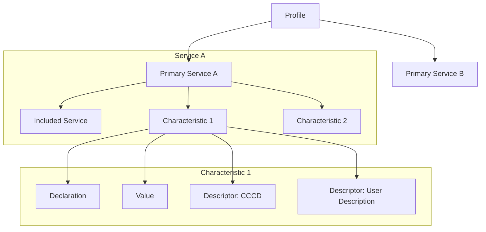

# GATT 核心概念与角色 (GATT Overview & Roles)

GATT (Generic Attribute Profile) 定义了蓝牙设备间发现服务、读取特征和写入特征的标准框架。它是所有 BLE 应用程序的基石。

> 核心规范参考: **Vol 3, Part G, Section 2**

---

## 1. GATT 角色 (GATT Roles)

在 GATT 通信中，设备被定义为以下两种角色之一：

### 1.1 GATT Server (服务端)
*   **持有者**: 包含实际数据（属性数据库）的一方。
*   **职责**: 接受来自 Client 的请求，并发送响应、通知 (Notification) 或指示 (Indication)。
*   **典型设备**: 传感器、心率计、手环。

### 1.2 GATT Client (客户端)
*   **发起者**: 向 Server 发起请求（读/写）的一方。
*   **职责**: 发现 Server 上的服务，并根据需要配置 Server 发送数据。
*   **典型设备**: 手机 (iOS/Android)、网关。

> **注意**: GATT 角色与链路层角色（Central/Peripheral）是独立的。虽然通常手机是 Central+Client，手环是 Peripheral+Server，但在某些场景下（如手机向手环同步时间），手机也可以作为 Server。

---

## 2. 属性的构成 (What is an Attribute?)

GATT 数据库中的每一条记录都被称为一个 **Attribute (属性)**。

| 组成部分 | 描述 | 示例 |
| :--- | :--- | :--- |
| **Attribute Handle** | 属性的地址/索引。由 Server 分配，Client 通过它访问。 | `0x001A` |
| **Attribute Type (UUID)** | 属性的“含义”。 | `0x2A37` (心率值) |
| **Attribute Value** | 属性存储的实际数据。 | `75 bpm` |
| **Permissions** | 谁能访问、如何访问。 | Read Only, Write, Encrypted |

---

## 3. GATT 层次结构 (Profile Hierarchy)

GATT 将数据组织成一个清晰的树状结构：

### 3.1 Service (服务)
*   功能的逻辑分组（如“心率服务”、“电池服务”）。
*   **Primary Service**: 主要服务，代表设备的主要功能。
*   **Included Service**: 被引用的其他服务。

### 3.2 Characteristic (特征)
*   数据的最小逻辑单元（如“心率测量值”）。
*   由 **Declaration**（元数据）、**Value**（实际值）和 **Descriptors**（可选配置）组成。

### 3.3 Descriptor (描述符)
*   对特征的补充描述。
*   **CCCD (Client Characteristic Configuration Descriptor)**: 最重要的描述符。Client 通过写入它来开启或关闭 Server 的通知 (Notify) 功能。