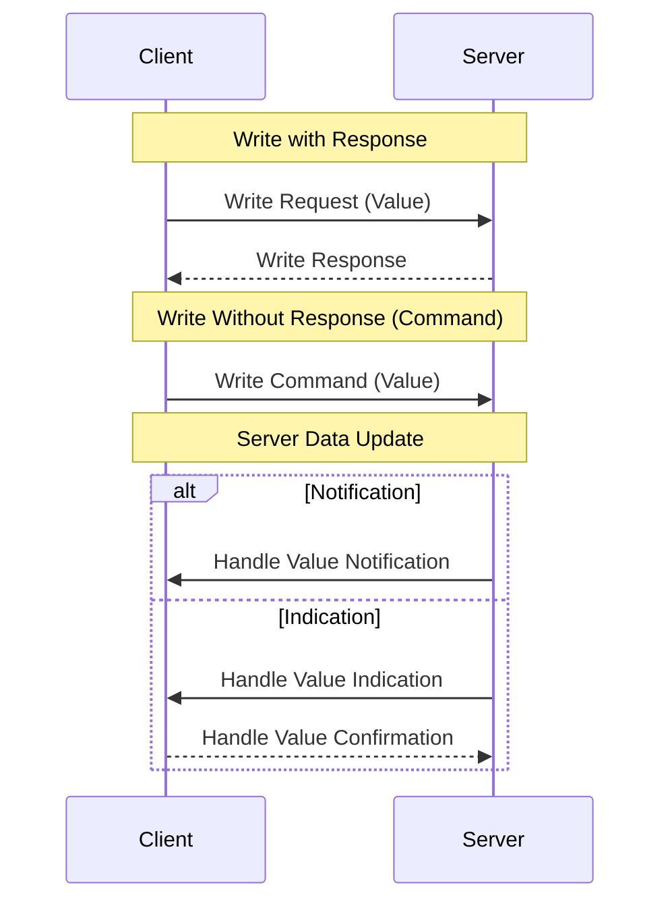

# GATT 交互操作 (GATT Procedures)

本章节总结了 GATT Client 与 Server 之间标准的数据交互流程。所有这些操作最终都由底层的 **Attribute Protocol (ATT)** 实现。

> 核心规范参考: **Vol 3, Part G, Section 4**

---

## 1. 发现操作 (Discovery)

在通信开始前，Client 需要了解 Server 的“底细”。

*   **Discover All Primary Services**: Client 扫描 Server 上所有的主服务。
*   **Discover Characteristics by UUID**: 查找特定功能的特征（例如：心率计的 Measurement 特征）。

---

## 2. 读取数据 (Read)

Client 从 Server 提取数据。

| 操作 (Procedure) | 描述 (Description) |
| :--- | :--- |
| **Read Characteristic Value** | 最基本的读取。通过 Handle 获取值。 |
| **Read Long Value** | 当特征值超过 MTU 时，分多次读取。 |
| **Read Multiple Values** | 一次请求读取多个特征的值。 |

---

## 3. 写入数据 (Write)

Client 向 Server 发送数据。

| 操作 (Procedure) | 确认机制 (Ack) | 描述 (Description) |
| :--- | :--- | :--- |
| **Write Request** | **需要确认** | Client 发送数据，Server 收到后必须回一个 `Write Response`。安全性高，速度慢。 |
| **Write Command** | **无需确认** | (也称 Write Without Response)。Client 只管发，不管 Server 有没有收到。速度快，效率高。 |
| **Reliable Write** | **带校验** | 复杂的写入流程，先发一段预写入，确认无误后再执行。 |

---

## 4. 服务端推送 (Server Initiated)

当 Server 的数据发生变化时，它可以主动推给 Client。

| 类型 (Type) | 确认机制 (Ack) | 描述 (Description) |
| :--- | :--- | :--- |
| **Notification** | **无确认** | Server 发送数据，Client 收到不回 Ack。适用于频率高、偶尔丢包也没关系的数据（如心率实时曲线）。 |
| **Indication** | **需要确认** | Server 发送数据，Client 必须回一个 `Handle Value Confirmation`。Server 在收到 Ack 前不会发下一个包。适用于重要状态变更。 |

---

## 5. MTU 交换 (Exchange MTU)

在建立连接后，为了提高传输效率，Client 通常会发起 **Exchange MTU Request**。
*   **目的**: 协商双方都能支持的最大数据包大小。
*   **默认**: 23 字节 (Payload 为 20 字节)。
*   **建议**: 现代设备通常设置为 247 或更高，以减少分包。