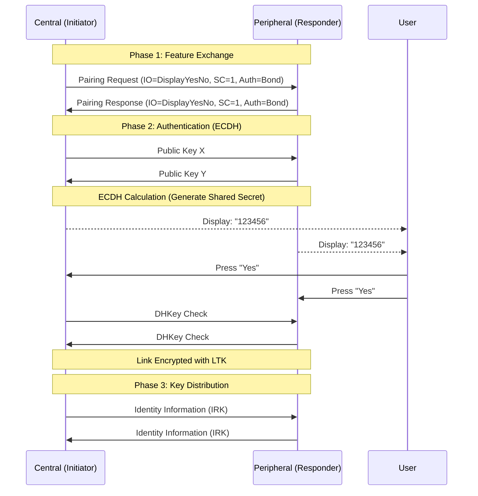

# SMP Pairing Process (配对与安全连接流程)

蓝牙低功耗 (BLE) 的安全性由 **Security Manager Protocol (SMP)** 保障。配对 (Pairing) 是两个设备交换能力、认证身份并生成加密密钥的过程。

> **核心参考**: *Bluetooth Core Spec v6.2, Vol 3, Part H*

---

## 1. 配对的三个阶段 (The 3 Phases)

配对过程分为三个连续的阶段：

```mermaid
graph TD
    P1[Phase 1: Pairing Feature Exchange] --> P2[Phase 2: Authentication & Encryption]
    P2 --> P3[Phase 3: Transport Specific Key Distribution]

    subgraph Phase 1
    direction TB
    Desc1[交换 IO Capabilities, AuthReq, OOB Flag<br>确定使用哪种配对方法]
    end

    subgraph Phase 2
    direction TB
    Desc2[生成 STK (Legacy) 或 LTK (Secure Conn)<br>执行认证 (Just Works / Passkey / Num Comp)]
    end

    subgraph Phase 3
    direction TB
    Desc3[分发 IRK (隐私), CSRK (签名), LTK (离线)<br>建立绑定关系 (Bonding)]
    end
```

*   **Phase 1**: 双方互发 `Pairing Request` 和 `Pairing Response`，协商“怎么配对”。
*   **Phase 2**: 执行具体的认证算法（如输入 6 位密码），生成加密链路的密钥。**这是最容易失败的阶段。**
*   **Phase 3**: 只有在 Phase 2 成功且双方都要求绑定 (Bonding) 时才会发生。交换用于未来重连的密钥。

---

## 2. 配对方法选择 (Association Models)

在 Phase 1，设备会根据各自的 **IO Capabilities (输入输出能力)** 和 **OOB (Out-of-Band)** 数据标志，决定使用哪种关联模型。

### 2.1 IO Capabilities 定义

| Capability | Description | Example |
| :--- | :--- | :--- |
| **NoInputNoOutput** | 无屏幕，无按钮（或仅有简单的确认键）。 | 智能灯泡、简单手环 |
| **DisplayOnly** | 有屏幕显示数字，无键盘。 | 电子秤、身份认证器 |
| **DisplayYesNo** | 有屏幕显示数字，有 Yes/No 确认键。 | 带有屏幕的车机、高端手环 |
| **KeyboardOnly** | 无屏幕，有键盘输入数字。 | 蓝牙键盘 |
| **KeyboardDisplay** | 有屏幕，有键盘。 | 手机、平板、PC |

### 2.2 核心映射矩阵 (Mapping Matrix)

这是解决配对问题的核心表格。
*   **行**: Initiator (通常是手机)
*   **列**: Responder (通常是外设)

| Initiator \ Responder | NoInputNoOutput | DisplayOnly | DisplayYesNo | KeyboardOnly | KeyboardDisplay |
| :--- | :--- | :--- | :--- | :--- | :--- |
| **NoInputNoOutput** | **Just Works** | **Just Works** | **Just Works** | **Just Works** | **Just Works** |
| **DisplayOnly** | **Just Works** | **Just Works** | **Just Works** | **Just Works** | **Just Works** |
| **DisplayYesNo** | **Just Works** | **Just Works** | **Just Works** | **Just Works** | **Just Works** (Legacy)<br>**Num Comp** (SC) |
| **KeyboardOnly** | **Just Works** | **Passkey** (R显示) | **Passkey** (R显示) | **Passkey** (I/R输入) | **Passkey** (R显示) |
| **KeyboardDisplay** | **Just Works** | **Passkey** (R显示) | **Num Comp** (SC)<br>**Passkey** (Legacy) | **Passkey** (I显示) | **Num Comp** (SC)<br>**Passkey** (Legacy) |

*   **Just Works**: 自动连接，无用户交互，抗窃听能力差（不能防 MITM）。
*   **Passkey Entry**: 一方显示 6 位数字，另一方输入。可防 MITM。
*   **Numeric Comparison** (仅 Secure Connections): 双方显示相同数字，用户确认 "Yes"。比 Passkey 更方便且安全。

---

## 3. Legacy Pairing vs Secure Connections

BLE 4.2 引入了 **LE Secure Connections (LESC)**，基于 **ECDH (Elliptic Curve Diffie-Hellman)** 算法，极大提升了安全性。

| 特性 | Legacy Pairing | Secure Connections (LESC) |
| :--- | :--- | :--- |
| **密钥生成** | 简单的临时密钥 (STK)。容易被抓包破解。 | 基于 P-256 椭圆曲线生成 LTK。抗被动窃听。 |
| **MITM 防护** | 依赖 Passkey。 | 依赖 Passkey 或 Numeric Comparison。 |
| **Just Works 安全性** | 极低。 | 依然不能防 MITM，但可以防被动抓包破解。 |
| **标志位** | AuthReq bit 3 = 0 | AuthReq bit 3 = 1 (SC) |

---

## 4. 典型交互流程 (Sequence)

以下展示一个 **Secure Connections (Numeric Comparison)** 的完整流程：



---

## 5. 常见失败原因

1.  **Pairing Failed (Error 0x05 - Authentication Timeout)**: 用户输入密码太慢（通常限制 30秒）。
2.  **Pairing Failed (Error 0x18 - Pairing Not Supported)**: 外设不支持配对。
3.  **Just Works unexpectedly**: 本来想用 Passkey，结果 IO Capability 设置错了（比如把手机设成了 NoInputNoOutput）。
