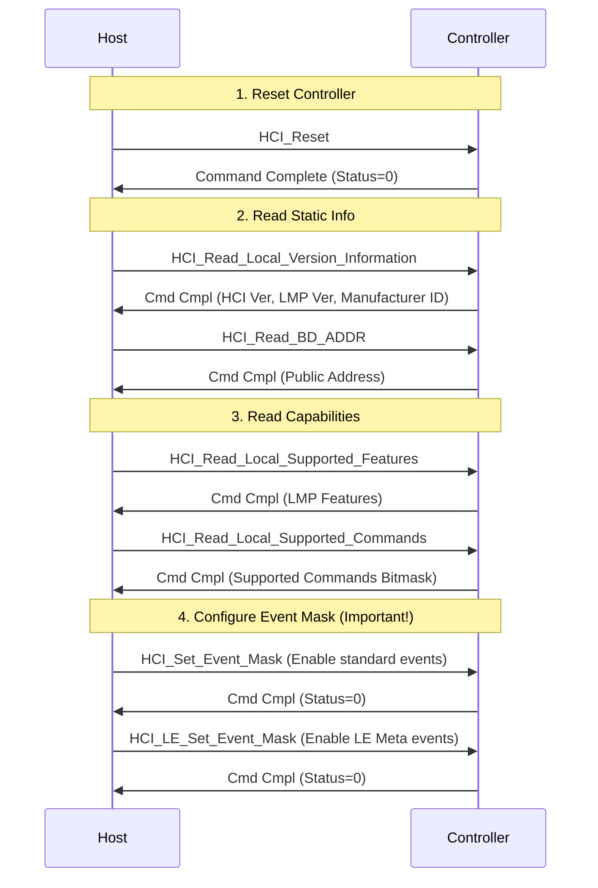

# HCI Initialization & Command Flow (初始化与核心流程)

当蓝牙协议栈启动时，Host 必须遵循特定的初始化序列来复位 Controller、读取其能力并进行配置。本章详细梳理了标准的初始化流程以及 BLE 最常用的广播与扫描流程。

> **核心参考**: *Bluetooth Core Spec v6.2, Vol 4, Part E, Section 7*

---

## 1. 系统复位与基本配置 (System Setup)

这是任何蓝牙设备上电后的第一步。

> **关键点**: 必须设置 **Event Mask**，否则 Controller 可能不会上报某些关键事件（如 Connection Complete），导致 Host 认为连接超时。

---

## 2. 广播流程 (Legacy Advertising Flow)

要让设备被发现（如作为 Peripheral），需要执行以下步骤：

1.  **Set Random Address** (如果使用随机地址):
    *   Opcode: `HCI_LE_Set_Random_Address`
    *   Host 负责生成随机地址（如 Static Random 或 RPA）。
2.  **Set Advertising Parameters**:
    *   Opcode: `HCI_LE_Set_Advertising_Parameters`
    *   配置 Interval (快/慢), Type (Ind/Direct), Own/Peer Address Type, Channel Map.
3.  **Set Advertising Data**:
    *   Opcode: `HCI_LE_Set_Advertising_Data`
    *   写入 31 字节的广播数据 (LTV 格式)。
4.  **Set Scan Response Data** (Optional):
    *   Opcode: `HCI_LE_Set_Scan_Response_Data`
    *   写入 31 字节的扫描响应数据。
5.  **Enable Advertising**:
    *   Opcode: `HCI_LE_Set_Advertising_Enable`
    *   Param: `0x01` (Enable).

---

## 3. 扫描流程 (Scanning Flow)

要发现周围的设备（如作为 Central），执行以下步骤：

1.  **Set Scan Parameters**:
    *   Opcode: `HCI_LE_Set_Scan_Parameters`
    *   Type: Active (请求更多数据) / Passive (仅监听).
    *   Interval & Window: 决定占空比。
2.  **Enable Scanning**:
    *   Opcode: `HCI_LE_Set_Scan_Enable`
    *   Param: `0x01` (Enable), `0x00` (Filter Duplicates off).

**事件上报**:
*   Controller 会源源不断地上报 `HCI_LE_Advertising_Report_Event` (Subcode `0x02`)。每个报告包含一个或多个被扫描到的设备信息（MAC, RSSI, Data）。

---

## 4. 连接建立流程 (Connection Creation)

1.  **Initiate Connection**:
    *   Opcode: `HCI_LE_Create_Connection`
    *   配置 Scan Interval/Window (用于捕获广播), Connection Interval (连接后的参数), Latency, Timeout.
2.  **Pending State**:
    *   命令发完后，Controller 返回 `Command Status` (而不是 Complete)，表示“正在干活”。
    *   此时不能再发其他特定命令（如再次 Create Connection）。
3.  **Completion**:
    *   当连接成功建立，Controller 上报 `HCI_LE_Connection_Complete_Event` (Subcode `0x01`)。
    *   包含 **Connection Handle** (后续数据传输的 ID) 和协商好的连接参数。

---

## 5. 常见问题 (Troubleshooting)

*   **Error 0x0C (Command Disallowed)**:
    *   原因：在错误的状态下发了命令。例如，广播已经开启时，试图修改广播参数。
    *   解法：先 Disable Advertising，修改参数，再 Enable。
*   **Error 0x11 (Unsupported Feature)**:
    *   原因：Host 试图使用 Controller 不支持的功能（如 2M PHY, Extended Adv）。
    *   解法：先读取 `Local Supported Features` 确认能力。
*   **Connection Complete 从不上报**:
    *   原因：忘记设置 `HCI_LE_Set_Event_Mask`，或者中断/UART 接收有问题。
