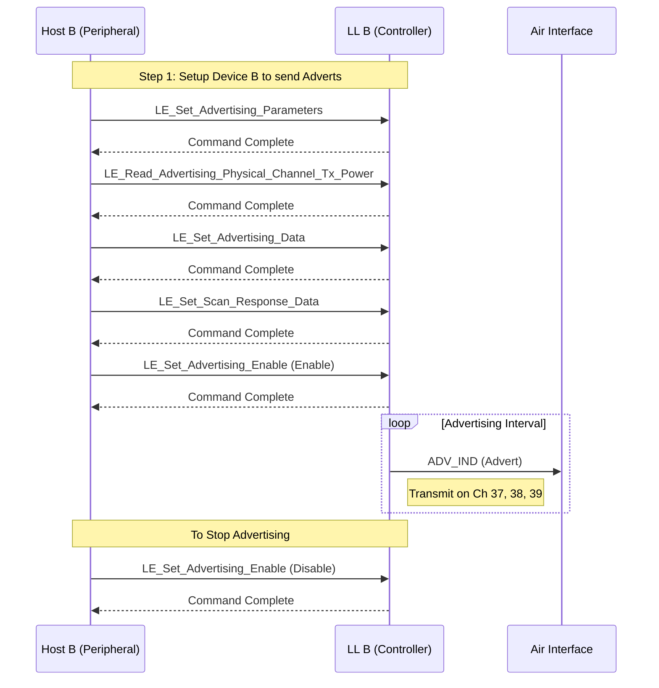
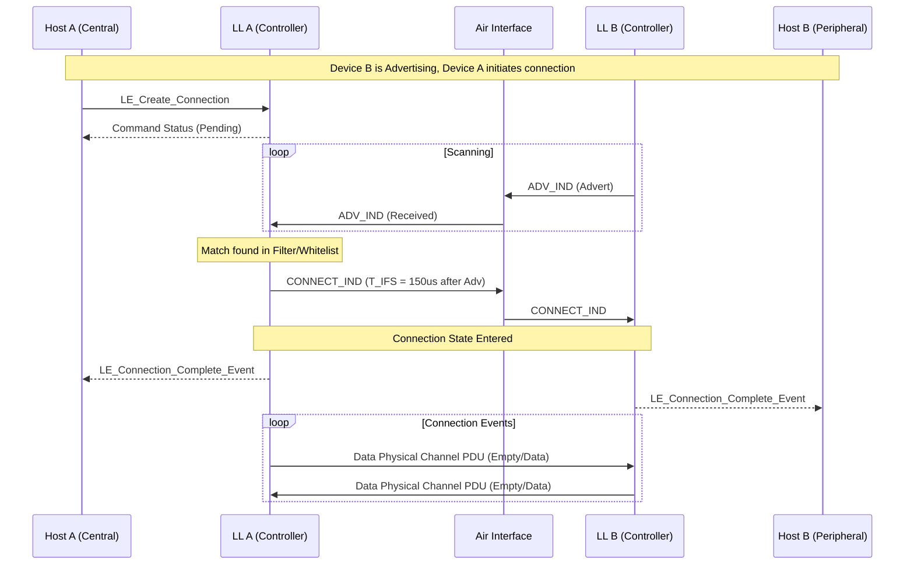

# BLE 连接建立流程 (Connection Establishment Flow)

本章节基于 **Vol 6, Part D: Message Sequence Charts**，详细展示了蓝牙低功耗设备从广播、扫描到连接建立的完整信令交互过程。

> 核心参考: Figure 3.1 (Undirected advertising) & Figure 5.1 (Initiating a connection)

---

## 1. 广播流程 (Undirected Advertising)

在连接建立之前，Peripheral 设备（Host B / LL B）必须先进入广播状态。

---

## 2. 连接建立流程 (Initiating a Connection)

Central 设备（Host A / LL A）发现广播并发起连接。

## 3. 关键 PDU 解析

在上述流程中，**`CONNECT_IND`** 是最关键的 PDU。它包含了连接的所有核心参数（如接入地址、CRC初始值、连接间隔、超时时间等）。一旦 LL B 接收到这个包，它就立即计算出第一个连接事件（Anchor Point）的时间，并切换到连接状态。

---

## 4. 异常处理 (Cancellation)

如果在连接建立前 Host A 改变主意：

1.  **Host A** 发送 `LE_Create_Connection_Cancel`。
2.  **LL A** 停止扫描/发起。
3.  **LL A** 向 **Host A** 返回 `LE_Connection_Complete` 事件，状态码为 `Unknown Connection Identifier` (或类似取消状态)，表明连接未建立。
