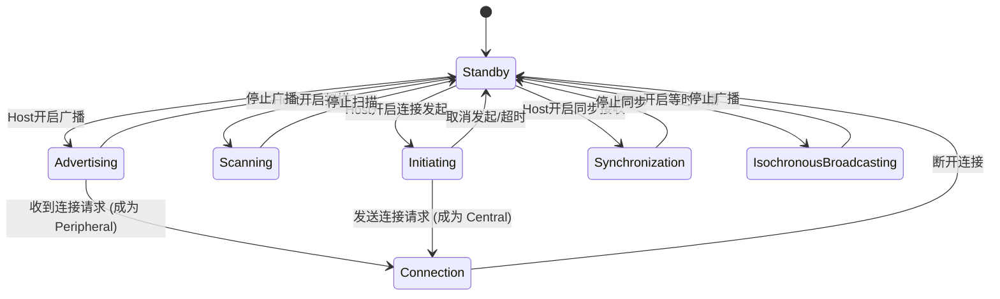

# BLE Link Layer 状态机 (Link Layer State Machine)

蓝牙低功耗 (BLE) 的链路层操作由一个状态机定义，包含以下 7 种状态。同一时刻，一个状态机实例只能处于一种状态。

> 核心规范参考: **Vol 6, Part B, Section 1.1**

---

## 1. 状态定义 (State Definitions)

| 状态 (State) | 角色 (Role) | 描述 (Description) |
| :--- | :--- | :--- |
| **Standby** (待机) | N/A | 初始状态。不发送也不接收任何数据包。可由任何其他状态进入。 |
| **Advertising** (广播) | **Advertiser** | 发送广播包，并可能监听/响应扫描请求。这是设备为了被发现或连接而必须进入的状态。 |
| **Scanning** (扫描) | **Scanner** | 监听空中的广播包。用于发现附近的广播者。 |
| **Initiating** (发起) | **Initiator** | 监听特定设备的广播包，并发送连接请求以发起连接。 |
| **Connection** (连接) | **Central / Peripheral** | 两个设备建立连接后的状态。由 Initiating 进入则为 Central，由 Advertising 进入则为 Peripheral。 |
| **Synchronization** (同步) | **Synchronized Receiver** | 监听周期性广播 (Periodic Advertising) 或广播等时组 (BIG)。用于接收周期性数据或广播音频。 |
| **Isochronous Broadcasting** (等时广播) | **Isochronous Broadcaster** | 发送等时广播数据 (BIS)。 |

---

## 2. 状态转换图 (State Diagram)

状态机的转换逻辑如下（基于 Figure 1.1）：

## 3. 连接状态中的角色 (Roles in Connection State)

当进入 Connection 状态时，设备必须扮演以下两种角色之一：

*   **Central (中心设备)**: 
    *   来源：从 **Initiating** 状态进入。
    *   职责：掌握时序主导权 (Master of Timing)，发起每一次连接事件 (Connection Event)。
    *   通信对象：可与多个 Peripheral 通信。

*   **Peripheral (外设)**:
    *   来源：从 **Advertising** 状态进入。
    *   职责：跟随 Central 的时序，在被 Central 寻址时回复。
    *   通信对象：与单一 Central 通信。

## 4. 多状态机支持 (Multiple State Machines)

现在的 BLE 控制器通常支持多个状态机实例并发运行。这意味着一个设备可以同时：
*   作为 Peripheral 连接手机 A。
*   作为 Central 连接手环 B。
*   同时在后台发送广播。

> **限制**: 所有的并发操作必须遵守调度器的时隙安排，因为物理层射频（PHY）通常只有一个，同一时刻只能干一件事。